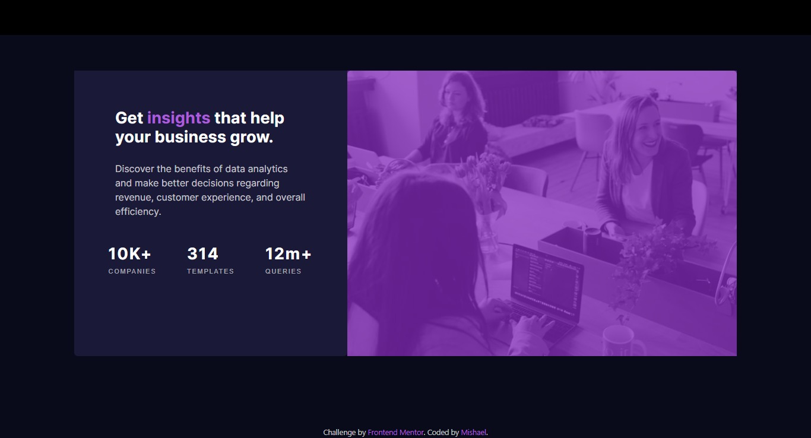

# Frontend Mentor - Stats preview card component solution

This is a solution to the [Stats preview card component challenge on Frontend Mentor](https://www.frontendmentor.io/challenges/stats-preview-card-component-8JqbgoU62). Frontend Mentor challenges help you improve your coding skills by building realistic projects. 

## Table of contents

- [Overview](#overview)
  - [The challenge](#the-challenge)
  - [Screenshot](#screenshot)
  - [Links](#links)
- [My process](#my-process)
  - [Built with](#built-with)
  - [What I learned](#what-i-learned)
  - [Continued development](#continued-development)
  - [Useful resources](#useful-resources)
- [Author](#author)

## Overview

### The challenge

Users should be able to:

- View the optimal layout depending on their device's screen size

### Screenshot



### Links

- [Solution URL](https://your-solution-url.com)
- [Live Site URL](https://your-live-site-url.com)

## My process

### Built with

- Semantic HTML5 markup
- CSS custom properties
- Flexbox
- Mobile-first workflow
- [Bootstrap5](https://getbootstrap.com/)
- [Lexend Deca Google Font](https://fonts.google.com/specimen/Lexend+Deca)
- [Inter Google Font](https://fonts.google.com/specimen/Inter)

### What I learned

I learnt some of bootstrap's screen sizing. That is, the different screen breakpoints that I came across during this project.
```md - 762px```
```lg - 992px```
```xl - 1200px```

These are the screen breakpoints I used at one point in the project or to complete the project and I believe they will be helpful in future projects.

### Continued development

I plan to minimize my use of pure CSS and keep on learning bootstrap so as to be more efficient when writing code.

### Useful resources

- [Bootstrap Docs](https://getbootstrap.com/docs/5.3/getting-started/introduction/) - If you want to get started with bootstrap or even if
you are already proficient in it, always refer to the docs. It is a real life-saver. 

## Author

- Twitter - [@mishael_codes](https://www.twitter.com/mishael_codes)
- Instagram - [@mishael.codes](https://www.instagram.com/mishael.codes)
- Frontend Mentor - [@mishael-codes](https://www.frontendmentor.io/profile/mishael-codes)